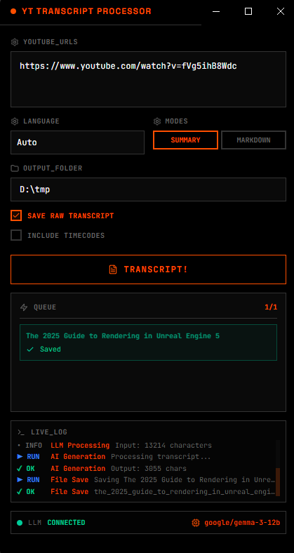

# YT Transcript Processor (Rust Edition)


A **lightweight** desktop application for extracting and processing YouTube transcripts using a local LLM (via LM Studio).



## Features

- **Extract Transcripts**: Formatting-free extraction of transcripts from YouTube videos.
- **Batch Processing**: Queue multiple videos to generate a large dataset for documentation or LLM ingestion.
- **Local AI Processing**: Use any model via LM Studio to clean, summarize, or structure the text.
- **Multiple Modes**:
    - **Summary**: Generate a concise overview with key takeaways.
    - **Markdown**: Convert to a detailed Markdown document, perfect for LLM ingestion.

## ⚙️ Prerequisites

1.  **LM Studio**: Required for AI processing.
    -   [Download LM Studio](https://lmstudio.ai/)

## 🛠️ LM Studio Setup

This application connects to LM Studio's local server API.

1.  Open **LM Studio**.
2.  **Search** for and **Download** a model. **Gemma 3-12b** is recommended.
3.  Select the model and increase the **Context Length**. This ensures long transcripts are not cut off.
4.  Leave the port to default & start server.

Once the server is running the YT Transcript Processor will automatically detect the connection.

## 📦 Installation & Usage

1.  Download the latest installer from the [Releases](https://github.com/julienrollin/Youtube-Transcript-Processor/releases) page.
2.  Run the installer (`YT Transcript Processor.exe`).
3.  Paste a YouTube URL, select your output folder and click **TRANSCRIPT!**.

## Development

To run this project locally:

```bash
# Prerequisites: Rust toolchain (rustup)

# Clone the repository
git clone https://github.com/julienrollin/Youtube-Transcript-Processor.git

# Install dependencies
npm install

# Run in development mode
npm run tauri dev

# Build for production
npm run tauri build
```

## Tech Stack

- **Backend**: Rust + Tauri 2.x
- **Frontend**: Vanilla HTML/CSS/JS
- **HTTP Client**: reqwest
- **Transcript Extraction**: Native Rust implementation
